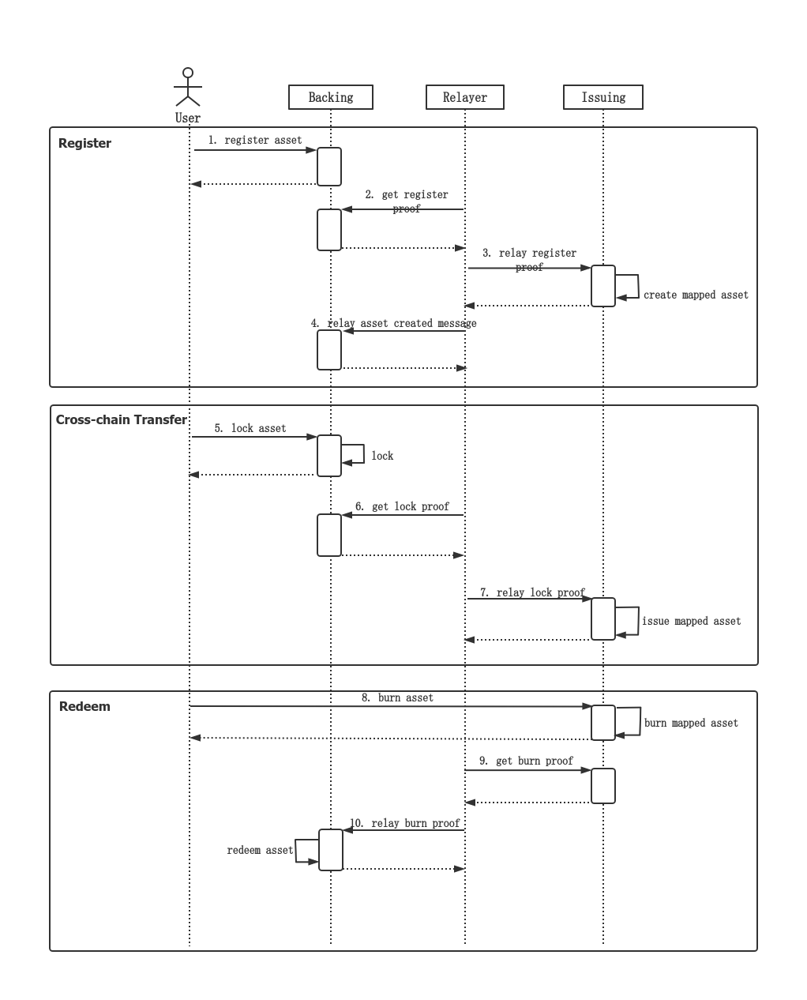

*The Darwinia cross-chain bridge is a generic bridge that allows third-party assets to use its cross-chain capabilities to be transferred between two blockchains. Before cross-chain transfers, third-party assets need to register with the Darwinia cross-chain bridge. This article describes how third-party can register assets and transfer funds using the Darwin cross-chain bridge and defines the interfaces involved in this process. In addition, it introduces how third-party assets are synchronized in the Darwin cross-chain bridges after upgrading.*

## Terminology

### Source and Target Chains

They refer to the source blockchain and the target blockchain for cross-chain asset transfer via a bridge respectively, or the caller and the callee of a remote chain call. Generally, a light client of the source chain needs to be built on the target chain to perform cross-chain validation of messages or events from the source chain.

### Native Assets vs. Mapped Assets

These two terms are a pair. A native asset is one that exists on its native chain, such as BTC on the Bitcoin network, as opposed to those that are wrapped or mapped, or that are transferred to other chains, such as wBTC. A native asset is typically an asset that has not been cross-chained, such as RING on Darwinia mainnet, while a mapped asset is one that is issued on another chain, such as ERC20-RING on the Ethereum network, by locking the native asset and with the locking proof in the CBA model.

### Relayer

A standalone application that provides the message relay service.

# CBA Model

CBA stands for Cryptocurrency Backed Asset. To build the CBA model, we need to build a ***Backing*** module on the source chain and an ***Issuing*** module on the target chain. Detailed explanations can be found in the relevant sections and [the technical paper](https://darwinia.network/Optimistic_Bridge_Technical_Paper(Preview)_EN.pdf).

- Backing Module
    
    The module that locks and unlocks the native assets on the source chain
    
- Issuing Module
    
    The module that issues and burns the mapped assets on the target chain
    

## Interfaces

### Backing Module (Source chain)

- ***register***(*asset_address*)
Parameter(s):
    - *asset_address*: Address of the native asset
- ***lock_and_remote_issue***(*asset_address, recipient, asset_option*)
    
    Parameter(s):
    
    - *asset_address*: Address of the native asset
    - *recipient*: The address of the recipient on the target chain
    - *asset_option*: Attributes of the asset

## Issuing Module (Target chain)

- ***burn_and_remote_unlock***(*asset_address, recipient, asset_option*)
    
    Parameter(s):
    
    - *asset_address*: Address of the native asset
    - *recipient*: The address of the recipient on the target chain
    - *asset_option*: Attributes of the asset

## Cross-chain Protocols

Following are the sequence diagrams of cross-chain protocols:
