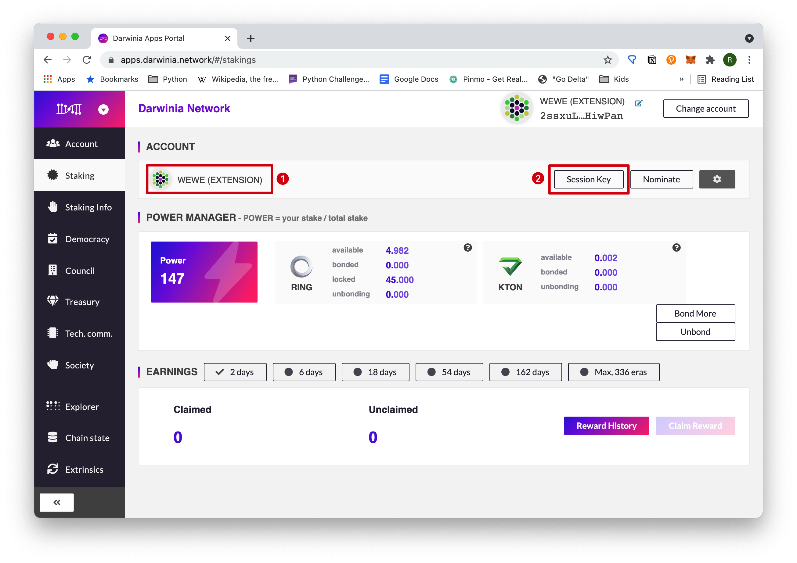
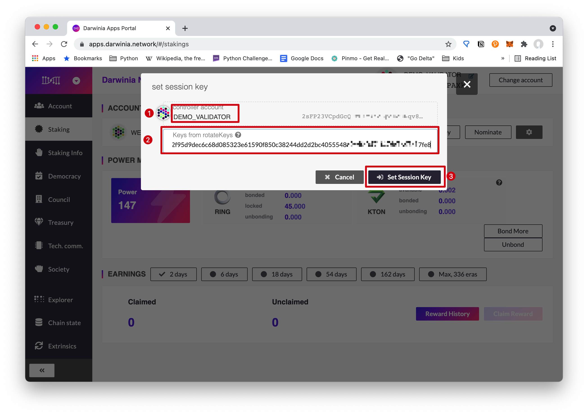
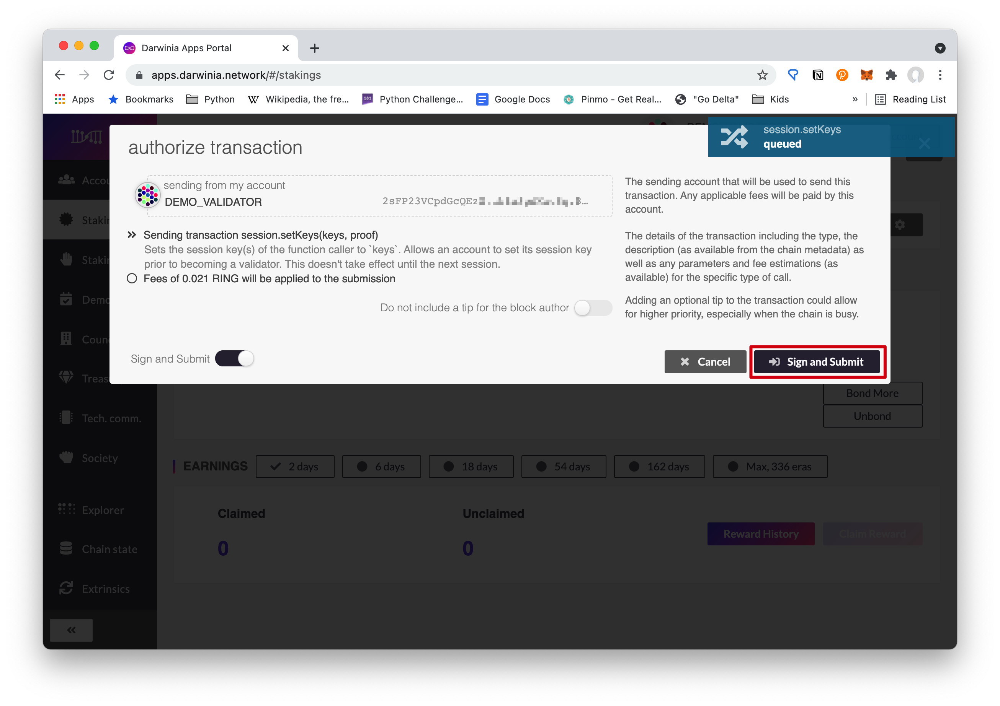
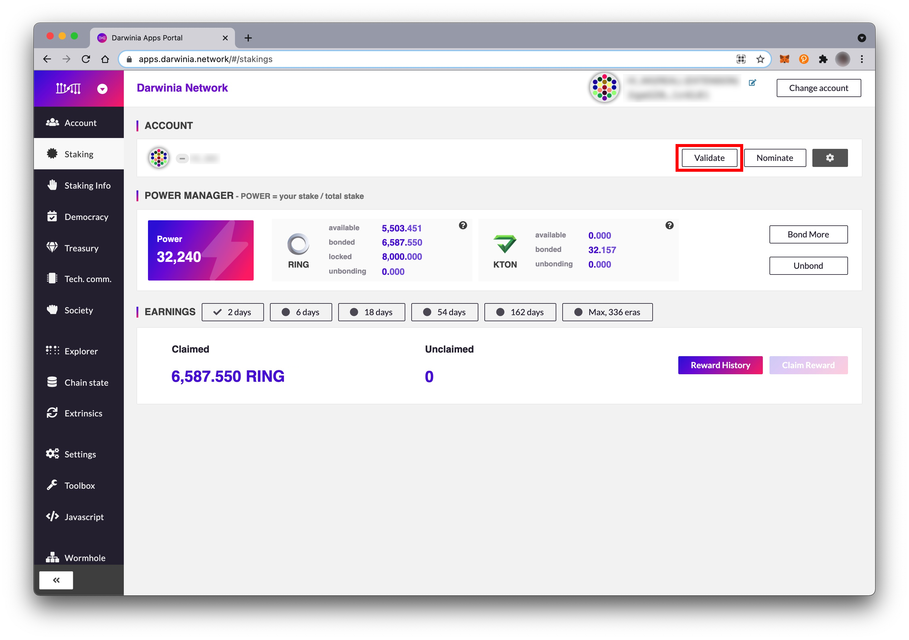

## Intro

More advanced users are encouraged to run for a validator. Once you become an offical validator, you can have a substantial passive source of income. To be eligible for running for a validator, you need to run a full node and stake some tokens. In this article, we will show you how to run for a validator step by step. 

## Prerequisites

To run for a validator, you need to meet these prerequisites:

1. You have necessary hardware and software to run a full node.
    >  If you do not know how to run a full node, please refer to [*Running a Node*](./wiki-tut-node).
2. You have some tokens to stake;
3. You are currently not a nominator.

## Steps

### Run Your Server as a Validator Node


```
$ ./darwinia --name my-darwinia-node --validator --rpc-methods=Unsafe --unsafe-rpc-external --ws-external --rpc-cors all
```

If you are using Docker, it should be like this:

```
$ docker run -it -v node-data:/darwinia/data -p 9933:9933 -p 9944:9944 quay.io/darwinia-network/darwinia:v0.11.4 --base-path /darwinia/data --name my-darwinia-node --validator --rpc-methods=Unsafe --rpc-external --rpc-cors all
```

### Get the Session Key of Your Running Node

Run the following command on the shell where your validator node is running.
```
$ curl http://127.0.0.1:9933 -H "Content-Type:application/json;charset=utf-8" -d \
'{
  "jsonrpc":"2.0",
  "id":1,
  "method":"author_rotateKeys",
  "params": []
}'
```

You will get a reponse similar to this.
```
{
  "jsonrpc":"2.0", "result":"0xba99ecfb4a87357a44ee3765cf617a6d81adf8f43e522db52e348d2e9d45ccde12d53d562e14bb18523fbc3032b786f44b2b92340f4756386d4baec68bbfb882bbaccce1440c84d7f5b67c8ecb956345130d5dbd07adfeba3d9482f95d9dec6c68d085323e61590f850c38244dd2d2bc4055548d9edfd0471f47da7667c17fe8",
  "id":1
  }
```
The "*result*" is the session key we need. (*This key is only for demonstration. Please DO NOT use it for yourself.*)

### Stake Some Tokens

Log in the [Darwinia Apps Portal](https://apps.darwinia.network) and enter "*Staking*" section, and click "*Staking now*".


Then set parameters accordingly and check for estimated Power value and KTON and click "*Bond*". For a detailed explanation of every item, please refer to [*How to Become a Nominator*](./quick-start-staking-nominator.md), but we recommend using different accounts for "*stash account*" and "*control account*" for better security and management.


### Set the Session Key

After staking, you can see your "*stash account*" is displayed on the left. Click "*Session Key*". If you are nominating someone, this button will not be displayed. You need to stop nonimating first.


Here the "control account" you set is displayed. Paste your session key and click "*Set Session Key*".


Then click "Sign and Submit" to continue.


### Set Validator Parameters

Click "*Validate*" and set the validator paramters.


The paramter "*reward commission percentage*" defines the proportion of the node's priority distribution of income, and the range is 0-100. (Example: For a 5% reward commission, this node will first receive 5% of the node's revenue, and the remaining 95% of the node's revenue will be distributed in proportion to the amount of one's token in staking, be it the validator or a nominator; Validator's income = node reward commission + staking reward share).
 

Now you are finished, but it will not take effect until the next era.
