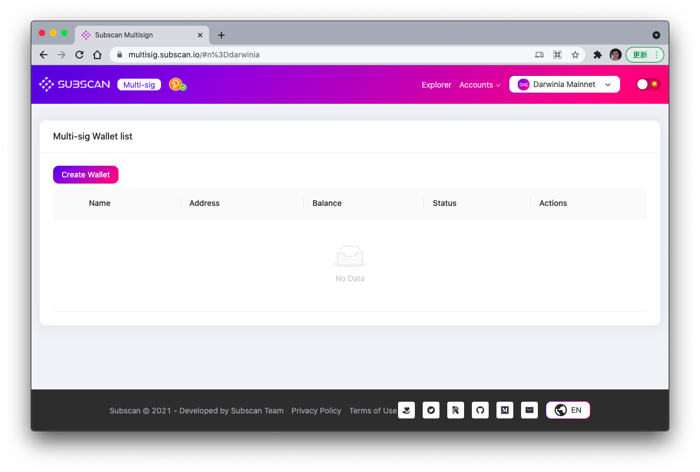

This document covers the basics of Darwinia and Crab account addresses and how they exist on-chain. For more infos, please see the [polkadot-accounts](https://wiki.polkadot.network/docs/learn-accounts).

## Address Format

- Darwinia addresses always start with the number 2.
- Crab addresses always start with the number 5.

## Obtaining and Managing an Address

A recommended method of keeping the accounts stored on your computer is using the [Polkadot{.js} extension](https://github.com/polkadot-js/extension). This extension remembers your accounts and allows you to clear your browser cache without fear. Still, don't forget to back up your seed phrase - if you lose access to this computer, or the extension somehow crashes beyond repair, the phrase will come in handy.

## Balance Types

When you view your account information, you may see multiple subsections of balances.

## Check Account Balance

- Via Subscan, for example:

    [https://darwinia.subscan.io/account/2rCtxgrCLsyh4gzfFpzEF3u1sks3pLwb4VnjyhMmFc7X4UQw](https://darwinia.subscan.io/account/2rCtxgrCLsyh4gzfFpzEF3u1sks3pLwb4VnjyhMmFc7X4UQw)

- Via Web-based Wallet

    [https://apps.darwinia.network/](https://apps.darwinia.network/)

    [https://polkadot.js.org/apps/](https://polkadot.js.org/apps/)

## Existential Deposit and Reaping

When you generate an account (address), you only generate a *key* that lets you access it. The account does not exist yet on-chain. For that, it needs the existential deposit: 0.0000333333 CRAB (on Crab Network) or 1 RING (on Darwinia Network).

Having an account go below the existential deposit causes that account to be *reaped*.

## Indices

A Darwinia or Crab address can have an index. An index is like a short and easy to remember version of an address. Claiming an index requires a deposit that is released when the index is cleared.

## Identities

The [Identities pallet](https://github.com/paritytech/substrate/tree/master/frame/identity) allows users to attach on-chain metadata to their accounts. This metadata can be verified by independent registrars to provide trustworthiness. To learn more about how to set or release an identity, how to define sub-accounts, or how to become a registrar, please read [this guide](https://wiki.polkadot.network/docs/learn-identity).

## Proxy Accounts

Darwinia comes with a generalized proxy account system that allows users to keep keys in cold storage while proxies act on their behalf with restricted (or unrestricted) functionality. See the [proxies](https://wiki.polkadot.network/docs/learn-proxies) page for more information.

## Multi-signature Accounts

It is possible to create a multi-signature account in Substrate-based chains. A multi-signature account is composed of one or more addresses and a threshold. The threshold defines how many signatories (participating addresses) need to agree on the submission of an extrinsic in order for the call to be successful.

Multi-signature accounts **cannot be modified after being created**. multi-sig account addresses are **deterministic**, i.e. you can always calculate the address of a multi-sig just by knowing the members and the threshold, without the account existing yet.

Subscan provide an easy-to-use multi-signature tool [https://multisig.subscan.io/](https://multisig.subscan.io/), it now supports Polkadot, Kusama, Darwinia, Crab.

## Address Conversion Tools

You can use the tool privided by Subscan to convert any SS58 address for any network for use on different networks.

[https://darwinia.subscan.io/tools/ss58_transform](https://darwinia.subscan.io/tools/ss58_transform)
